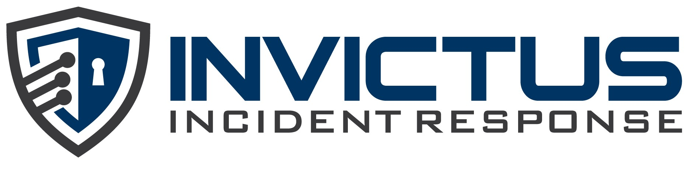

[](https://kubeforensys.readthedocs.io/en/latest/)


# KubeForenSys - Kubernetes Data Collection Tool

A tool for collecting Kubernetes cluster data and ingesting it into Azure Log Analytics workspace for analysis post-compromise.

## Documentation

Documentation is available at the [KubeForenSys documentation](https://kubeforensys.readthedocs.io/en/latest/).

## What it does

KubeForenSys is a Python-based tool that automatically collects various types of data from Kubernetes clusters and sends it to Azure Log Analytics workspace. It specifically focusses on collecting data from Azure Kubernetes Service clusters.

### Features

- **Pod Logs Collection**: Retrieves logs from all running pods across namespaces
- **Kubernetes Events**: Collects cluster events
- **Command History**: Extracts command history from containers for security analysis
- **Service Accounts**: Gathers service account information and configurations
- **Suspicious Pod Detection**: Identifies potentially suspicious pods based on security criteria
- **RBAC Bindings**: Collects Role-Based Access Control bindings and roles
- **CronJob Information**: Retrieves details about cronjob containers
- **Network Policies**: Gathers network policy configurations
- **Azure Integration**: Automatically provisions Log Analytics workspace and data collection infrastructure

## Prerequisites

- Python 3.8 or higher
- `kubectl` configured and authenticated to your Kubernetes cluster
- Azure subscription with appropriate permissions

## Installation

1. **Clone the repository**:
   ```bash
   git clone git@github.com:invictus-ir/KubeForenSys.git
   cd KubeForenSys
   ```

2. **Install Python dependencies**:
   ```bash
   pip install -r requirements.txt
   ```

3. **Set up environment variables**:
   
   Create a `.env` file in the project root:
   ```bash
   SUBSCRIPTION_ID="your-azure-subscription-id"
   CLUSTER_NAME="your-aks-cluster-name"
   RESOURCE_GROUP_NAME="your-resource-group-name"
   ```
   
   Or set them as environment variables:
   ```bash
   export SUBSCRIPTION_ID="your-azure-subscription-id"
   export CLUSTER_NAME="your-aks-cluster-name"
   export RESOURCE_GROUP_NAME="your-resource-group-name"
   ```

## Usage

### Basic Usage

Run the tool with default settings:
```bash
python main.py
```

### Advanced Usage

Customize the data collection with command-line arguments:
```bash
python main.py \
  --since_seconds 172800 \
  --workspace_name "MyKubeWorkspace" \
  --dce_name "MyDataCollectionEndpoint" \
  --location "eastus"
```

### Command Line Options

- `--since_seconds`: Fetch logs since these many seconds ago (default: 86400 = 24 hours)
- `--workspace_name`: Name of the Log Analytics workspace (default: "Kube-LAW")
- `--dce_name`: Name of the Data Collection Endpoint (default: "Kube-DCE")
- `--location`: Azure region (default: "westeurope")

## What Gets Collected

The tool collects the following data types and uploads them to separate custom tables in Log Analytics:

1. **kubelogs_CL**: Container logs from all pods
2. **kubeevents_CL**: Kubernetes cluster events
3. **commandhistory_CL**: Command history from containers
4. **serviceaccounts_CL**: Service account configurations
5. **suspiciouspods_CL**: Potentially suspicious pods
6. **rbacbindings_CL**: RBAC bindings and roles
7. **cronjobs_CL**: CronJob container information
8. **networkpolicies_CL**: Network policy configurations

## Azure Infrastructure

The tool automatically creates:
- Log Analytics workspace
- Data Collection Endpoint (DCE)
- Data Collection Rules (DCR) for each data type
- Custom tables in Log Analytics workspace

## Security Considerations

- The tool skips system namespaces (`kube-system`, `azure-arc`, `gatekeeper-system`)
- Uses Azure DefaultAzureCredential for authentication
- Data is retained for 30 days by default. This can be altered through the Azure portal where necessary.

## Troubleshooting

1. **Kubernetes Access**: Verify `kubectl` is configured and can access the cluster
2. **Resource Creation**: Check that your Azure subscription has permissions to create Log Analytics resources (see custom_role.json)
3. **Network Access**: Ensure the data collection endpoint has proper network access configured

## Dependencies

- `kubernetes`: Kubernetes Python client
- `python-dotenv`: Environment variable management
- `azure.identity`: Azure authentication
- `azure.monitor.ingestion`: Azure Monitor data ingestion
- `azure.mgmt.containerservice`: Azure Container Service management
- `azure.mgmt.loganalytics`: Azure Log Analytics management